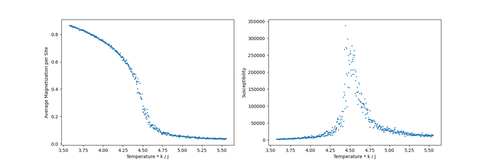

# Ising Model Simulation

Two and three dimensional [Ising model](https://en.wikipedia.org/wiki/Ising_model) simulations using [Swendsen-Wang algorithm](https://en.wikipedia.org/wiki/Swendsen%E2%80%93Wang_algorithm).

## Compiling

Open the project's directory in terminal. Type `make` (or `mingw32-make` depending on your environment) to compile.

## Examples

### Two dimensional Ising model simulation

Run `main_2` and enter the parameters. You can also write the parameters in a file and use it as the input.

**Example command:**

For Windows:
```
main_2 < ./examples/input_2/1.txt
```

For macOS or a Linux based OS:
```
./main_2 < ./examples/input_2/1.txt
```

The results will be written into the files specified in the input.

You can visualize the results using `plot.py`.

> [!NOTE]
> You need to have [matplotlib](https://matplotlib.org/stable/install/index.html) installed for this step.

**Example command:**
```
python plot.py -M ./examples/output_2/m1.txt -S ./examples/output_2/s1.txt --save ./examples/output_2/figure1.png
```


- You may need to type `python3` instead of `python` depending on your environment.
- `--save` is optional.
- If you do not want matplotlib GUI to show up, you can pass the argument `--no-gui`.
- If you need help about the usage of `plot.py`, you can try `python plot.py -h`.

### Three dimensional Ising model simulation

This is similar to the two dimensional case.

**Example commands:**

For Windows:
```
main_3 < ./examples/input_3/1.txt
python plot.py -M ./examples/output_3/m1.txt -S ./examples/output_3/s1.txt --save ./examples/output_3/figure1.png
```

For macOS or a Linux based OS:
```
./main_3 < ./examples/input_3/1.txt
python plot.py -M ./examples/output_3/m1.txt -S ./examples/output_3/s1.txt --save ./examples/output_3/figure1.png
```


